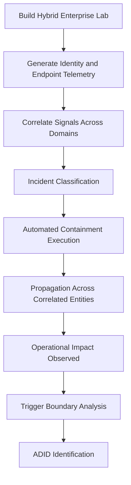
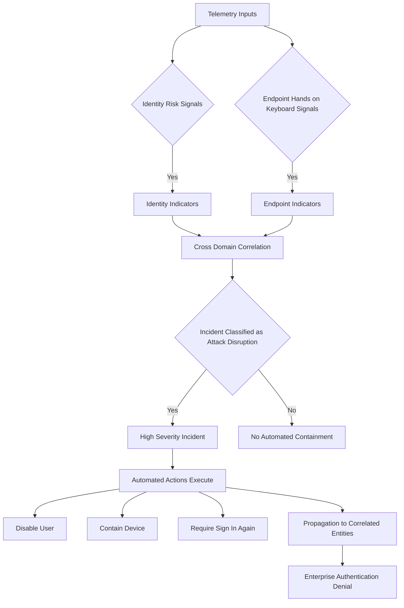
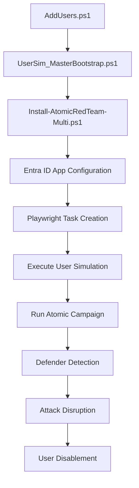

# Autonomous Defense Induced Disruption (ADID) Lab

Hybrid enterprise research environment for evaluating the structural risks of autonomous containment systems in modern cybersecurity platforms.

This repository supports experimental analysis of **Autonomous Defense Induced Disruption (ADID)** — a condition in which legitimate automated defensive actions result in operational disruption.

---

# 1. Research Context

Modern security platforms increasingly implement automated containment capabilities designed to operate at machine speed. While this improves response time, it introduces a structural resilience question:

> Can detection-driven autonomous containment produce enterprise-wide operational denial independent of attacker persistence?

This lab evaluates that question under controlled conditions.

---

# 2. Autonomous Defense Induced Disruption (ADID)

## Formal Definition

Autonomous Defense Induced Disruption (ADID) is a condition in which automated cybersecurity response mechanisms execute legitimate containment actions that disrupt normal organizational operations without requiring attacker control over enterprise infrastructure.

## Core Characteristics

- Detection-driven enforcement
- Incident-level classification gating
- Cross-domain propagation across identity and endpoint layers
- Organizational context blindness
- Potential control-plane disruption

## Mechanism

1. Telemetry produces compromise-consistent signals.
2. The autonomous system classifies a high-confidence incident.
3. Automated containment is executed.
4. Enforcement propagates across correlated entities.
5. Organizational availability is degraded or denied.

## Distinguishing Feature

ADID does not rely on attacker persistence or system takeover.  
Disruption arises from defensive automation operating as designed.

---

# 3. Research Objective

To evaluate whether autonomous containment systems:

- Enforce actions based solely on detection confidence thresholds.
- Propagate containment across correlated entities.
- Disable privileged accounts absent exclusion safeguards.
- Create operational denial proportional to correlation rather than business criticality.

---

# 4. Experimental Design Overview

Detailed methodology is documented in:

`docs/EXPERIMENTAL_DESIGN.md`

At a high level, the experiment:

- Constructs a hybrid enterprise environment.
- Generates cross-domain telemetry.
- Triggers incident-level classification.
- Observes automated containment execution.
- Measures propagation scope and recovery impact.

The observable enforcement boundary is defined at the incident classification stage rather than alert volume.

---

# 5. High-Level Architecture

## On-Premises Infrastructure

- Active Directory Domain Controller
- Windows Server infrastructure services
- Domain-joined Windows 11 endpoints

## Cloud Services

- Microsoft Entra ID (Azure AD)
- Microsoft 365 E5
- Microsoft Defender XDR
- Attack Disruption enabled

---

# 6. Research Methodology

---

# 7. ADID Trigger Threshold Model

---

# 8. ADID Taxonomy Classification

| Dimension | Classification | Description |
|------------|---------------|-------------|
| Threat Origin | Defensive System Induced | Disruption originates from automated defense |
| Decision Boundary | Incident Classification | Enforcement gated by high-confidence incident |
| Impact Type | Availability Denial | Identity and access disruption |
| Context Awareness | Organizational Blind | No evaluation of business hierarchy |
| Propagation | Correlation-Based | Scales across linked entities |
| Escalation Risk | Control Plane Impact | Privileged accounts may be disabled |

---

# 9. Repository Architecture

---

# 10. Execution Order Summary

1. AddUsers.ps1  
2. UserSim_MasterBootstrap.ps1  
3. Install-AtomicRedTeam-Multi.ps1  
4. Configure Entra ID App  
5. Create and run user simulation  
6. Execute Atomic campaign  
7. Observe Defender telemetry and containment  

---

# 11. Key Research Finding

Autonomous containment is gated by incident-level classification and executes without evaluating organizational hierarchy.

Containment scope propagates across correlated entities, potentially including privileged accounts.

This creates a structural resilience risk when exclusion safeguards are not mandatory.

---

# 12. Scope of This Repository

This repository provides:

- Infrastructure build scripts
- Simulation tooling
- Telemetry generation framework
- Experimental observation model

It does not provide detection configuration tuning or production deployment guidance.

---

# 13. Intended Use

This environment is provided for:

- Security research
- Controlled experimentation
- Academic analysis
- Reproducible lab simulation

Not intended for production deployment.

---

# 14. License

See LICENSE file.

---

# 15. Disclaimer

This repository is for research and educational purposes only.  
Use responsibly in controlled environments.
