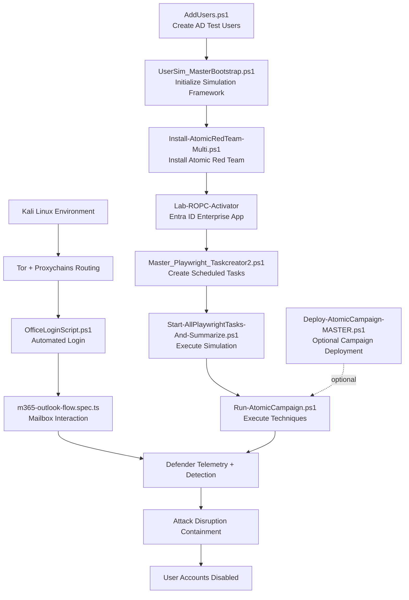

---

# Repository Architecture


# Autonomous Defense Induced Disruption Lab

Hybrid enterprise lab environment for researching **Autonomous Defense Induced Disruption (ADID)**.  
This repository provides infrastructure build scripts and step-by-step instructions for recreating a hybrid enterprise environment used to study AI-driven autonomous containment behavior.

---

## Purpose of the Lab Environment

This lab was designed to:

- Simulate a modern hybrid enterprise architecture  
- Integrate on-premises Active Directory with cloud identity services  
- Generate cross-domain telemetry across identity and endpoint layers  
- Enable autonomous containment actions across identity and endpoint control planes  
- Reproduce enterprise conditions required to test Attack Disruption scenarios  

---

## What the Lab Framework Provides

- Preconfigured virtual machine templates  
- Step-by-step hybrid deployment guidance  
- Active Directory domain controllers and Windows Server roles  
- Domain-joined Windows 11 enterprise endpoints  
- Test identities and user objects  
- Azure AD (Entra ID) and Microsoft 365 integration  

---

## High-Level Architecture

### On-Premises Infrastructure
- Active Directory Domain Controller  
- Windows Server infrastructure services  
- Domain-joined Windows 11 endpoints  

### Cloud Services
- Azure AD (Microsoft Entra ID)  
- Microsoft 365 E5 tenant  
- Microsoft Defender XDR  

---

## Scope of This Repository

This repository contains:

- Lab build instructions  
- Infrastructure configuration scripts  
- Environment reconstruction guidance  

Detection, investigation, and automated containment actions occur within Microsoft Defender XDR and are triggered through simulated activity generated by this lab environment.

---

## Research Focus

This lab supports experimentation and analysis of:

- AI-driven autonomous response systems  
- Cross-domain containment behavior  
- Operational risks of automated security enforcement  
- Autonomous Defense Induced Disruption (ADID) scenarios  

---

## Intended Use

This environment is provided for:

- Security research  
- Controlled experimentation  
- Educational use  
- Reproducible lab simulation  

It is not intended for production deployment.

---

# Repository File Map

This section explains what each file in the repository does and **when it is used** during lab setup and execution.

---

## Root Structure

```
/autonomous-defense-induced-disruption-lab
│
├── README.md
├── LICENSE
│
├── AddUsers.ps1
├── UserSim_MasterBootstrap.ps1
├── Install-AtomicRedTeam-Multi.ps1
│
├── Master_Playwright_Taskcreator2.ps1
├── Run-Playwright.ps1
├── Start-AllPlaywrightTasks-And-Summarize.ps1
│
├── OfficeLoginScript.ps1
├── m365-outlook-flow.spec.ts
├── Routing Playwright Through Tor (documentation)
│
├── Run-AtomicCampaign.ps1
├── Deploy-AtomicCampaign-MASTER.ps1
│
└── Entra ID App Setup (Lab-ROPC-Activator)
```

---

## File Descriptions and Usage Order

### Infrastructure Preparation

**AddUsers.ps1**  
Creates randomized Active Directory test users.  
Used after domain setup and before user simulation.

**UserSim_MasterBootstrap.ps1**  
Initializes the user simulation environment and supporting structure.  
Run once before launching any simulation activity.

---

### Endpoint Preparation

**Install-AtomicRedTeam-Multi.ps1**  
Installs Atomic Red Team across Windows test endpoints.  
Required before running technique campaigns.

---

### Windows User Activity Simulation

**Master_Playwright_Taskcreator2.ps1**  
Creates scheduled tasks for large-scale Playwright user activity.

**Run-Playwright.ps1**  
Executes browser automation workflows for simulated users.

**Start-AllPlaywrightTasks-And-Summarize.ps1**  
Starts simulation across all endpoints and collects execution status.

---

### External (Kali Linux) Activity Simulation

**OfficeLoginScript.ps1**  
Automates Microsoft 365 authentication from external systems.

**m365-outlook-flow.spec.ts**  
Playwright workflow for mailbox access and interaction.

**Routing Playwright Through Tor (documentation)**  
Instructions for routing automation traffic through Tor / proxychains.

---

### Adversarial Technique Execution

**Run-AtomicCampaign.ps1**  
Executes selected Atomic Red Team techniques and collects telemetry.  
Run while logged in as each test user.

---

### Optional Deployment Automation

**Deploy-AtomicCampaign-MASTER.ps1**  
Automates distribution of campaign configuration across endpoints.  
Optional — only needed for centralized deployment.

---

### Identity Configuration

**Entra ID App Setup (Lab-ROPC-Activator)**  
Enterprise application configuration enabling automated authentication for lab users.

---

## Execution Flow Summary

Recommended operational order:

1. AddUsers.ps1  
2. UserSim_MasterBootstrap.ps1  
3. Install-AtomicRedTeam-Multi.ps1  
4. Configure Entra ID App (Lab-ROPC-Activator)  
5. Master_Playwright_Taskcreator2.ps1  
6. Start-AllPlaywrightTasks-And-Summarize.ps1  
7. OfficeLoginScript.ps1 (from Kali via proxychains)  
8. Run-AtomicCampaign.ps1  

Optional:
- Deploy-AtomicCampaign-MASTER.ps1

---

## Files That May Be Optional

You may not need the following depending on deployment method:

- Deploy-AtomicCampaign-MASTER.ps1 (only for automated campaign staging)

All other files are part of the core execution chain.

---


