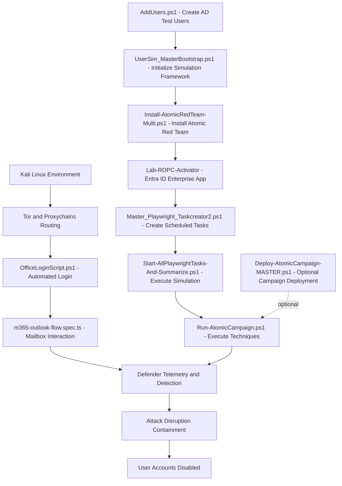
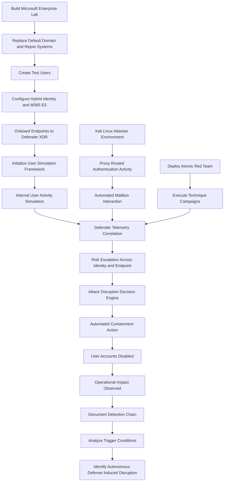
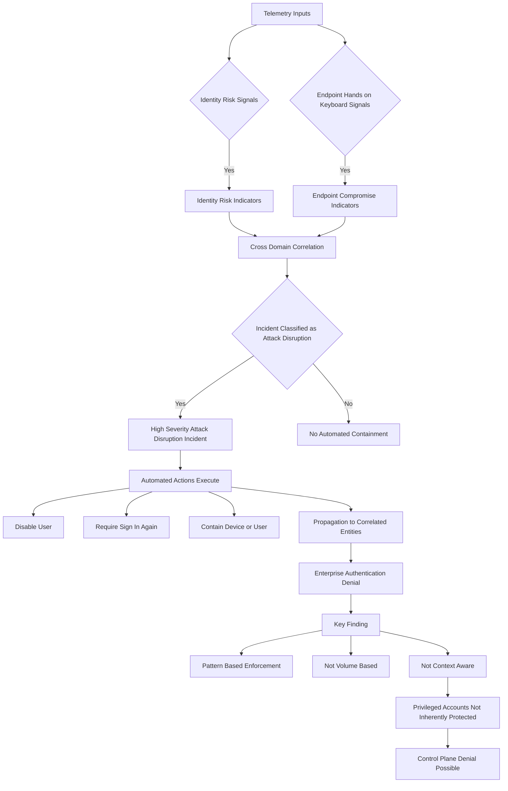

# Autonomous Defense Induced Disruption Lab

Hybrid enterprise lab environment for researching **Autonomous Defense Induced Disruption (ADID)**.  
This repository provides infrastructure build scripts and step-by-step instructions for recreating a hybrid enterprise environment used to study AI-driven autonomous containment behavior.

---

# Repository Architecture



---

## Purpose of the Lab Environment

This lab was designed to:

- Simulate a modern hybrid enterprise architecture  
- Integrate on-premises Active Directory with cloud identity services  
- Generate cross-domain telemetry across identity and endpoint layers  
- Enable autonomous containment actions across identity and endpoint control planes  
- Reproduce enterprise conditions required to test Attack Disruption scenarios  

---

## What the Lab Framework Provides

- Preconfigured virtual machine templates  
- Step-by-step hybrid deployment guidance  
- Active Directory domain controllers and Windows Server roles  
- Domain-joined Windows 11 enterprise endpoints  
- Test identities and user objects  
- Azure AD (Entra ID) and Microsoft 365 integration  

---

## High-Level Architecture

### On-Premises Infrastructure
- Active Directory Domain Controller  
- Windows Server infrastructure services  
- Domain-joined Windows 11 endpoints  

### Cloud Services
- Azure AD (Microsoft Entra ID)  
- Microsoft 365 E5 tenant  
- Microsoft Defender XDR  

---

## Scope of This Repository

This repository contains:

- Lab build instructions  
- Infrastructure configuration scripts  
- Environment reconstruction guidance  

Detection, investigation, and automated containment actions occur within Microsoft Defender XDR and are triggered through simulated activity generated by this lab environment.

---

## Research Focus

This lab supports experimentation and analysis of:

- AI-driven autonomous response systems  
- Cross-domain containment behavior  
- Operational risks of automated security enforcement  
- Autonomous Defense Induced Disruption (ADID) scenarios  

---

## Intended Use

This environment is provided for:

- Security research  
- Controlled experimentation  
- Educational use  
- Reproducible lab simulation  

It is not intended for production deployment.

---

# Repository File Map

```
/autonomous-defense-induced-disruption-lab
│
├── README.md
├── LICENSE
│
├── scripts/
│   ├── AddUsers.ps1
│   ├── UserSim_MasterBootstrap.ps1
│   ├── Install-AtomicRedTeam-Multi.ps1
│   ├── Master_Playwright_Taskcreator2.ps1
│   ├── Run-Playwright.ps1
│   ├── Start-AllPlaywrightTasks-And-Summarize.ps1
│   ├── Run-AtomicCampaign.ps1
│   ├── Deploy-AtomicCampaign-MASTER.ps1 (optional)
│   └── Entra-ID-App-Setup-Lab-ROPC-Activator.ps1
│
├── playwright/
│   └── m365-outlook-flow.spec.ts
│
├── attacker/
│   ├── OfficeLoginScript.ps1
│   └── Routing-Playwright-Through-Tor.md
│
├── artifacts/
│   └── research payloads
│
└── docs/
    └── supporting documentation
```

---

# Execution Order Summary

1. scripts/AddUsers.ps1  
2. scripts/UserSim_MasterBootstrap.ps1  
3. scripts/Install-AtomicRedTeam-Multi.ps1  
4. Configure Entra ID App  
5. scripts/Master_Playwright_Taskcreator2.ps1  
6. scripts/Start-AllPlaywrightTasks-And-Summarize.ps1  
7. attacker/OfficeLoginScript.ps1  
8. scripts/Run-AtomicCampaign.ps1  

Optional:
- scripts/Deploy-AtomicCampaign-MASTER.ps1

---

# Research Methodology



---
---

## Autonomous Defense Induced Disruption (ADID)

**Autonomous Defense Induced Disruption (ADID)** is a condition in which automated cybersecurity response mechanisms execute legitimate containment actions that unintentionally or intentionally disrupt normal organizational operations.

### Formal Definition
ADID occurs when an autonomous security system, operating on detection-driven decision logic, enforces protective controls — such as identity disablement, device containment, or access restriction — in a way that produces operational denial **without requiring attacker control of enterprise systems**.

### Core Characteristics

- **Detection-driven enforcement**  
  Actions are triggered by threat confidence thresholds rather than organizational context.

- **Legitimate defensive behavior**  
  The system operates exactly as designed; no system compromise or malfunction is required.

- **Propagation across correlated entities**  
  Containment actions extend across identities, devices, or infrastructure linked by telemetry.

- **Lack of organizational context awareness**  
  Role criticality, privilege hierarchy, and operational dependency are not evaluated during enforcement.

- **Potential control-plane disruption**  
  Administrative or privileged accounts may be restricted, impairing recovery capability.

### Mechanism

1. Telemetry produces indicators consistent with compromise.  
2. The autonomous system classifies a high-confidence incident.  
3. Automated containment is executed.  
4. Enforcement propagates across correlated entities.  
5. Organizational availability is degraded or denied.

### Distinguishing Feature

ADID is not caused by attacker persistence or system takeover.  
It results from **autonomous defensive enforcement operating without full organizational awareness**.

### Risk Implication

As autonomous response capabilities expand across security platforms, ADID represents a structural resilience risk in which protective mechanisms can become vectors of enterprise disruption if not governed by contextual safeguards.

---
# ADID Trigger Threshold Model

This diagram represents the **observable decision boundary** that leads to automated containment.



---

# Key Research Finding

Autonomous containment is triggered by **high-confidence incident classification**, not organizational context.

Enforcement scope propagates to all correlated entities, including privileged accounts.

This enables **Autonomous Defense Induced Disruption (ADID)** — operational denial caused by legitimate defensive automation.

---

# License

See LICENSE file.

---

# Disclaimer

This repository is for controlled research and educational use only.  
Do not deploy in production environments.
