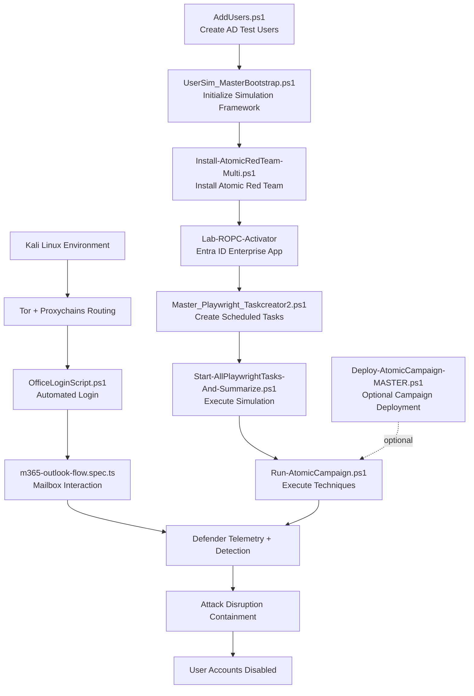
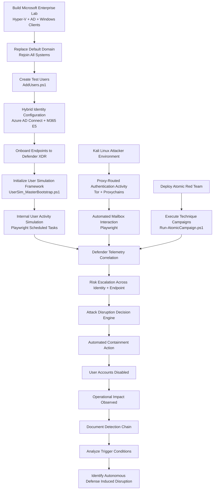

---

# Repository Architecture


# Autonomous Defense Induced Disruption Lab

Hybrid enterprise lab environment for researching **Autonomous Defense Induced Disruption (ADID)**.  
This repository provides infrastructure build scripts and step-by-step instructions for recreating a hybrid enterprise environment used to study AI-driven autonomous containment behavior.

---

## Purpose of the Lab Environment

This lab was designed to:

- Simulate a modern hybrid enterprise architecture  
- Integrate on-premises Active Directory with cloud identity services  
- Generate cross-domain telemetry across identity and endpoint layers  
- Enable autonomous containment actions across identity and endpoint control planes  
- Reproduce enterprise conditions required to test Attack Disruption scenarios  

---

## What the Lab Framework Provides

- Preconfigured virtual machine templates  
- Step-by-step hybrid deployment guidance  
- Active Directory domain controllers and Windows Server roles  
- Domain-joined Windows 11 enterprise endpoints  
- Test identities and user objects  
- Azure AD (Entra ID) and Microsoft 365 integration  

---

## High-Level Architecture

### On-Premises Infrastructure
- Active Directory Domain Controller  
- Windows Server infrastructure services  
- Domain-joined Windows 11 endpoints  

### Cloud Services
- Azure AD (Microsoft Entra ID)  
- Microsoft 365 E5 tenant  
- Microsoft Defender XDR  

---

## Scope of This Repository

This repository contains:

- Lab build instructions  
- Infrastructure configuration scripts  
- Environment reconstruction guidance  

Detection, investigation, and automated containment actions occur within Microsoft Defender XDR and are triggered through simulated activity generated by this lab environment.

---

## Research Focus

This lab supports experimentation and analysis of:

- AI-driven autonomous response systems  
- Cross-domain containment behavior  
- Operational risks of automated security enforcement  
- Autonomous Defense Induced Disruption (ADID) scenarios  

---

## Intended Use

This environment is provided for:

- Security research  
- Controlled experimentation  
- Educational use  
- Reproducible lab simulation  

It is not intended for production deployment.

---

# Repository File Map

This repository is organized by functional role to support reproducibility and clarity.

---

## Folder Structure

```
/autonomous-defense-induced-disruption-lab
│
├── README.md
├── LICENSE
│
├── scripts/
│   ├── AddUsers.ps1
│   ├── UserSim_MasterBootstrap.ps1
│   ├── Install-AtomicRedTeam-Multi.ps1
│   ├── Master_Playwright_Taskcreator2.ps1
│   ├── Run-Playwright.ps1
│   ├── Start-AllPlaywrightTasks-And-Summarize.ps1
│   ├── Run-AtomicCampaign.ps1
│   ├── Deploy-AtomicCampaign-MASTER.ps1 (optional)
│   └── Entra-ID-App-Setup-Lab-ROPC-Activator.ps1
│
├── playwright/
│   └── m365-outlook-flow.spec.ts
│
├── attacker/
│   ├── OfficeLoginScript.ps1
│   └── Routing-Playwright-Through-Tor.md
│
├── artifacts/
│   └── opw2uvbyv8on4idnrirebi5h7.docx
│
└── docs/
    └── supporting documentation
```

---

## Folder Purpose

### scripts/
Windows-based lab automation and execution logic.

These scripts run inside the hybrid enterprise environment and generate telemetry used for research observation.

---

### playwright/
Browser automation workflows executed by simulation systems.

Defines user interaction behavior inside Microsoft 365 services.

---

### attacker/
External simulation components executed from Kali Linux or other non-domain systems.

Used to generate proxy-routed authentication and mailbox activity.

---

### artifacts/
Research artifacts and payloads used during simulation activity.

Not required for infrastructure setup but used during experiments.

---

### docs/
Human-readable documentation, setup notes, and reference material.

---

## Execution Flow by Folder

### Infrastructure and Environment Preparation
```
scripts/AddUsers.ps1
scripts/UserSim_MasterBootstrap.ps1
scripts/Install-AtomicRedTeam-Multi.ps1
scripts/Entra-ID-App-Setup-Lab-ROPC-Activator.ps1
```

---

### Windows User Simulation
```
scripts/Master_Playwright_Taskcreator2.ps1
scripts/Run-Playwright.ps1
scripts/Start-AllPlaywrightTasks-And-Summarize.ps1
```

---

### External Activity Simulation (Kali Linux)
```
attacker/OfficeLoginScript.ps1
playwright/m365-outlook-flow.spec.ts
attacker/Routing-Playwright-Through-Tor.md
```

---

### Adversarial Technique Execution
```
scripts/Run-AtomicCampaign.ps1
```

Optional automated deployment:
```
scripts/Deploy-AtomicCampaign-MASTER.ps1
```

---

## Execution Order Summary

1. scripts/AddUsers.ps1  
2. scripts/UserSim_MasterBootstrap.ps1  
3. scripts/Install-AtomicRedTeam-Multi.ps1  
4. Configure Entra ID App  
5. scripts/Master_Playwright_Taskcreator2.ps1  
6. scripts/Start-AllPlaywrightTasks-And-Summarize.ps1  
7. attacker/OfficeLoginScript.ps1 (via proxychains)  
8. scripts/Run-AtomicCampaign.ps1  

Optional:
- scripts/Deploy-AtomicCampaign-MASTER.ps1

---

## Files That May Be Optional

You may not need the following depending on deployment method:

- Deploy-AtomicCampaign-MASTER.ps1 (only for automated campaign staging)

All other files are part of the core execution chain.

---

---

# Research Methodology


